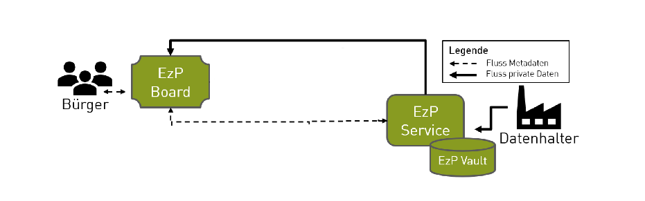

# EzP Development
### Milestone Overview
---

## Milestone 1: Results

- Everyone got familiar with the Project and the Framework
- Everyone chose a role in the project
    - frontend developer, backend developer, database expert, devops manager (version control, etc.), user manual and developer documentation manager
- Various Bug fixes
- Concept for Milestone 2

---

## Milestone 2: General Objectives

- Update entire CI/CD PIpeline and implement proper Versioning
- Rework Documentation and Usermanuals
- Implement MVP(Minimal Viable Product) for EzP Service

---

## Milestone 2: MVP Development

---

## Milestone 2: MVP Development

- **Objective:** Develop a Minimal Viable Product for EzP Service
- **Completion:** Dec 20, 2023
- **Key Deliverables:**
  - GDPR-compliant data storage system
  - Data entry user interface for small businesses
  - Backend services for data operations
  - Initial functionality and security testing

---

## Milestone 3: Integration with EzP Board

---

## Milestone 3: Integration with EzP Board

- **Objective:** Integrate MVP with EzP Board for data management
- **Completion:** Feb 7, 2024
- **Key Deliverables:**
  - Interface within EzP Board for user data requests
  - API development for EzP Service and Board interaction
  - Comprehensive system testing
  - User feedback collection and system iteration

---

## Milestone 3: First Release

- Version 1.0.0
    - Mostly bug free
    - No loose ends i.e. buttons without functionality etc.
    - Release Notes with Known Issues etc.

---
